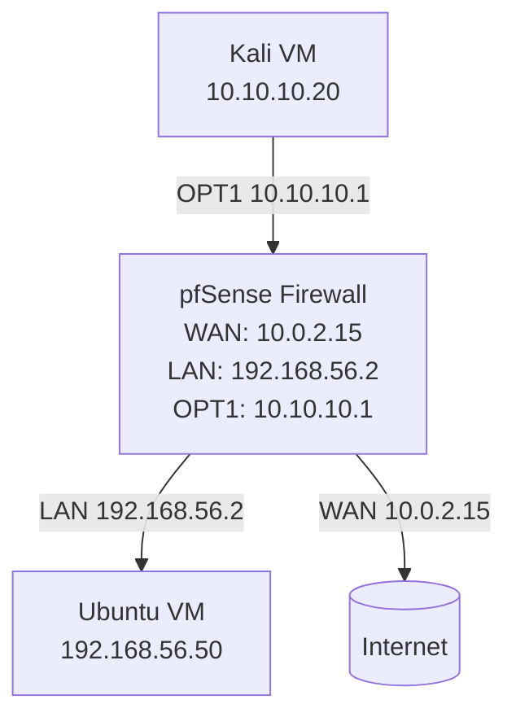

#  pfSense IDS/IPS Lab with Suricata

##  Project Overview
This project demonstrates setting up a pfSense firewall with Suricata IDS/IPS 
to block unsafe traffic (Telnet, brute-force SSH, botnet C2) and log alerts 
for review. The lab simulates real-world attack traffic from Kali Linux to 
an Ubuntu victim machine, routed through pfSense.

##  Lab Topology

## Configuration
- **pfSense**
  - Interfaces: WAN (10.0.2.15), LAN (192.168.56.2), OPT1 (10.10.10.1)
  - DHCP reservations for Ubuntu & Kali
  - NAT Port Forward for Telnet/SSH testing
- **Suricata**
  - Enabled on WAN + OPT1
  - Rulesets: `emerging-telnet.rules`, `emerging-ssh.rules`, `emerging-botcc.rules`
  - Block Offenders enabled (IPS mode)

## Attack Simulation
- **Telnet Scan (Nmap)**

``nmap -p 23 192.168.56.50``
→ Alerted as `ET TELNET Outbound Connection Detected`

- **SSH Brute-Force (Hydra)**

``hydra -l root -P rockyou.txt ssh://192.168.56.50``

→ Blocked after multiple attempts, logged in Suricata

- **Aggressive Nmap Scan**

``nmap -A 192.168.56.50``
→ Triggered multiple scan alerts

##  Results
- Unsafe Telnet traffic detected and blocked
- SSH brute-force attempts detected and blocked
- Alerts viewable in pfSense GUI and system logs
- Logs exported in EVE JSON format for SIEM integration

##  Future Work
- Send Suricata logs to Splunk or ELK
- Configure a wireguard VPN to secure remote access and test that connections are properly encryped and logged.
- Implement Nessus Essentials to identify and patch critical vulnerabilities on lab VMs, validating fixes with rescans. 

